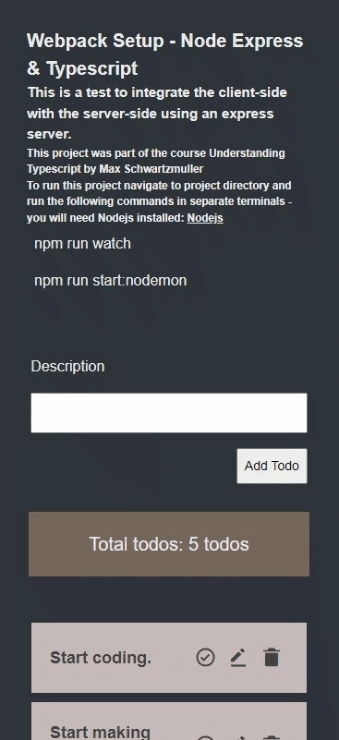

[](https://opensource.org/licenses/MIT)

# TABLE OF CONTENTS

[Project Title](#project-title)<br>
[Description](#description)<br>
[Installation & Setup](#installation--setup)<br>
[Github](#github)<br>
[Contact Me](#contact-me)<br>
[Licence](#licence)

## Project Title

A simple Todo Application with Node, Express and Typescript

## Description

This project is a full-stack Todo List application developed as a learning exercise to explore the integration of Node.js, Express, and TypeScript in building a modern web application. The primary focus is on creating a robust backend with RESTful API routes and connecting them seamlessly to a responsive frontend, while implementing advanced programming paradigms and build tools.

## Project Overview

The Todo List app demonstrates the practical implementation of:

- **Backend Development**: Utilizing Node.js and Express to create a scalable server-side architecture.
- **TypeScript Integration**: Leveraging TypeScript for both frontend and backend to ensure type safety and improve code quality.
- **RESTful API Design**: Implementing CRUD operations for todo items through well-structured API endpoints.
- **Frontend-Backend Connection**: Exploring techniques to efficiently connect Express routes to frontend components.
- **State Management**: Handling application state and synchronizing it between the client and server.
- **Webpack Configuration**: Implementing separate webpack configurations for client and server sides, optimizing the build process for both frontend and backend components.

## Key Programming Paradigms and Techniques

- **Object-Oriented Programming (OOP)**: Extensively using OOP principles to create modular, reusable, and maintainable code. This includes creating classes for Todo items, TodoList components, and other UI elements.
- **Custom Event Handlers**: Implementing a robust event-driven architecture using custom events. This allows for decoupled communication between components, enhancing the application's flexibility and scalability.
- **Component-Based Architecture**: Structuring the frontend using a component-based approach, promoting reusability and separation of concerns.
- **Asynchronous Programming**: Utilizing async/await and Promises for efficient handling of asynchronous operations, particularly in API calls and data fetching.
- **Build Process Optimization**: Leveraging webpack's powerful features to create optimized builds for both client and server, including code splitting, asset management, and environment-specific configurations.

This project serves as a hands-on approach to understanding the full development cycle of a web application, from server-side logic to client-side rendering, with a strong emphasis on TypeScript's role in creating maintainable and scalable code. It showcases the power of object-oriented design, event-driven programming, and advanced build tools in modern web development.

## Installation & Setup

To get this Todo application running on your local machine, follow these steps:

1. Clone the repository:

```bash

git clone [respository-url]
cd [repository-name]

```

2. Install dependencies:

```bash

npm install

```

3. Build both client and server:

```bash

npm run build:both

```

4. Start the server using Nodemon(for auto-reloading):

```bash

npm run start:nodemon

```

## Developing Mode

For development purposes, you can use the following commands:

To start the client-side webpack dev server with hot reloading(opens in chrome browser):

```bash

npm run watch:client

```

To watch and rebuild the server-side code on changes:

```bash

npm run watch:server

```

To run both concurrently:

```bash

npm run watch

```

## Building For Production

To build for client side production:

```bash

npm run build:client

```

To build for server side production:

```bash

npm run build:server

```

To build both concurrently:

```bash

npm run build:both

```

Make sure you have Node.js and npm installed on your system before running these commands. The application uses webpack for both client and server builds, ensuring optimized production builds and a smooth development experience with hot reloading.

## Snapshot



## Github

[Github](https://github.com/Sho-ayb)

## Contact Me

[Linked In](www.linkedin.com/in/shoaybchoudhry)

## Licence

MIT License

Please click on the badge for more details on the licence.

[](https://opensource.org/licenses/MIT)
